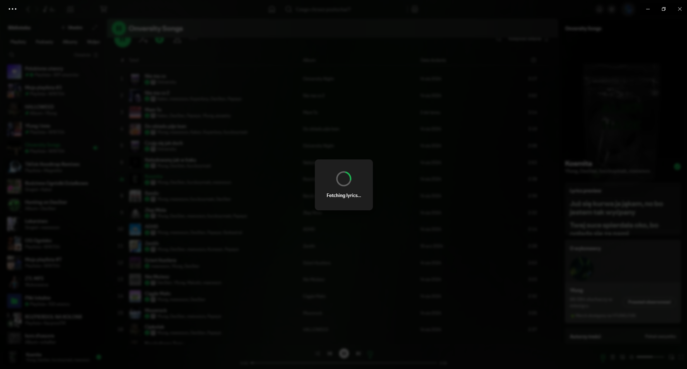
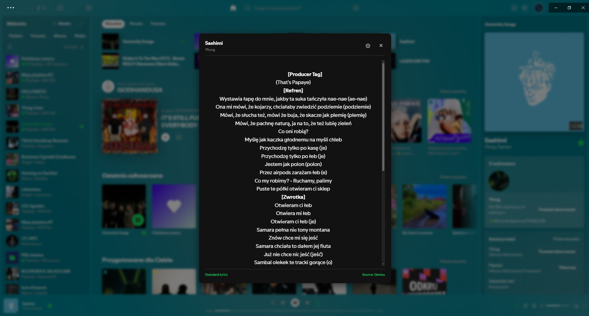

#  Genius Lyrics for Spicetify

A lightweight Spicetify extension that fetches and displays song lyrics from [Genius](https://genius.com) in a clean popup modal. Supports lyrics with section annotations like `[Chorus]`, `[Verse 1]`, etc.

---

## ✨ Features

- 🔍 Automatically fetches lyrics for the currently playing song
- 📄 Displays full lyrics with formatting and section annotations
- ⚙️ Includes a rich settings panel to customize appearance and behavior:
  - Font size adjustment
  - Theme selection (Dark, Light, Custom)
  - Background, text, and highlight colors
  - Background opacity and window blur controls
  - Text alignment and corner radius options
  - Line spacing customization
  - Toggles for bold annotations, auto-open, auto-scroll, caching lyrics, showing timestamps, and custom colors
- 💡 Shows a floating modal with a dark theme by default
- 🔗 Includes a source link to the original Genius page
- 🎯 Works seamlessly with Spicetify's Topbar

---

## 🖼 Preview

### Lyrics Modal with Settings Panel

### Loading Modal  


---

### Lyrics Modal  


---

## 📦 Installation

1. **Download the script**  
   Save the file as `genius-lyrics.js`.

2. **Move it to your Spicetify Extensions folder**  
   Typically located at:

   ```bash
   %appdata%\Local\spicetify\Extensions
